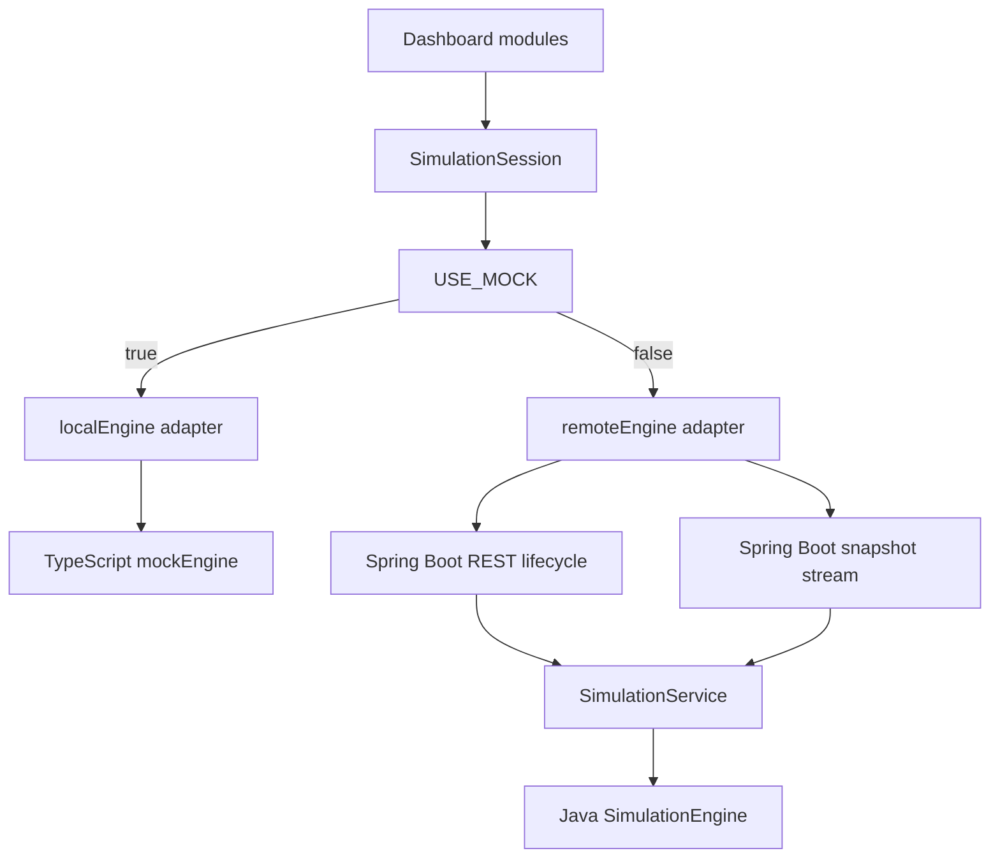

# Virus Simulator Context

## Domain Vocabulary

**Agent**  
A person-like simulation cell with normalized `x`/`y` coordinates, an SEIR state, and counters for exposed and infectious days.

**AgentState**  
One of `S`, `E`, `I`, or `R`: susceptible, exposed, infectious, recovered.

**TransmissionLink**  
A one-day relationship between an infectious source agent and a newly exposed target agent. The frontend uses links to draw the optional transmission network.

**SimulationConfig**  
The parameter set for a run: population size, initial infected percentage, transmission rate, incubation period, infectious period, recovery rate, random seed, model type, and simulation duration (`maxDays`).

**SimulationSnapshot**  
The day-level state delivered to the dashboard. It contains the day number, SEIR counts, deaths, and the current agent cells.

**HistoryPoint**  
A snapshot retained for the SEIR chart. History is capped naturally by the 100-day simulation limit.

**SimulationStats**  
Derived metrics for the dashboard: peak infectious count/day, total infected, attack rate, R0, new infections, active cases, and recovery percentage.

**SimulationEvent**  
A timeline message emitted by the engine, such as first transmission, rapid increase, or completion.

**SimulationEngine**  
The frontend seam used by the dashboard session. The local adapter runs the TypeScript engine in-browser; the remote adapter starts the Spring Boot engine and ingests WebSocket snapshots.

**SimulationSession**  
The Svelte module in `frontend/src/lib/stores/simulation.svelte.ts` that owns dashboard state, lifecycle actions, loading/error flags, and the local/backend source selection.

## Current Call Flow



## Engine Source Switch

The dashboard defaults to the local TypeScript engine while the Java backend is still being validated.

Use the Java backend by setting:

```bash
VITE_USE_MOCK=false
```

Then restart the frontend. In backend mode:

- `POST /api/simulation/start` starts the Java simulation.
- `POST /api/simulation/pause` pauses the scheduler.
- `POST /api/simulation/reset` resets the current Java config.
- `GET /api/simulation/config` returns the current Java config.
- `WS /ws/simulation` streams `snapshot`, `complete`, `connected`, and `error` messages.

## Invariants

- The local and Java engines use the same seeded LCG and SEIR rules.
- The simulation runs one simulated day per tick.
- Ticks run every 200ms.
- Runs stop at the configured `maxDays` value.
- R0 is `transmissionRate * infectiousPeriod`.
- Mortality is not implemented; `deaths` remains 0 and is not shown in the dashboard.
- Heatmap rendering is not implemented; the view option is not part of the current interface.
- In backend mode, config changes apply when the run is started or reset, not continuously while the scheduler is running.

## Payload Notes

The backend currently streams full agent arrays every tick. This is acceptable for the development prototype, but large populations will eventually need delta encoding or a lower tick frequency.
